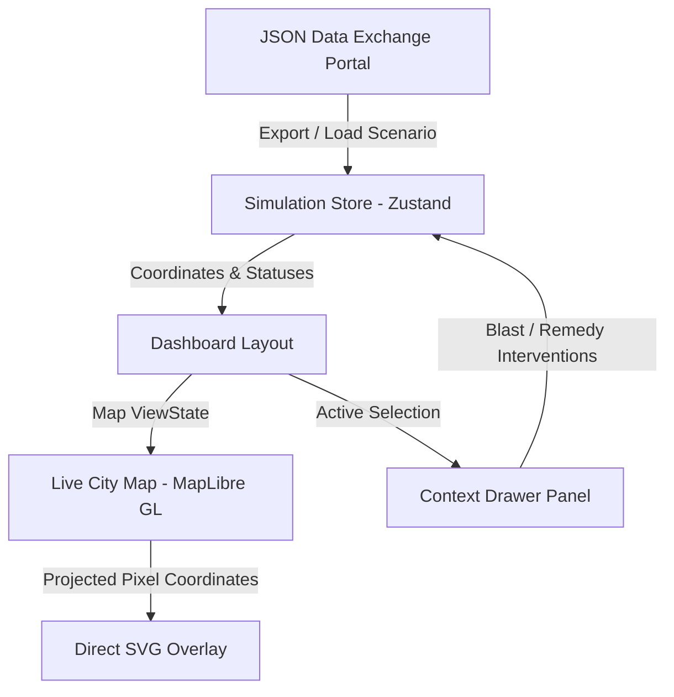

# Pralayaant: Nagpur City Cascading Infrastructure Simulator

An interactive, premium-grade real-time disaster simulation and response console for Nagpur's critical municipal networks. Modeled on real physical locations in Nagpur, this simulator visualizes how failures in one infrastructure node (e.g., electrical grids) trigger severe downstream cascades in water supply, telecom exchanges, public mobility, and healthcare sectors as well.

## 1. Problem Statement & Solution Overview

### The Problem
Modern municipal grids are deeply interdependent. A failure at a primary power grid doesn't just stop electricity but it also shuts down water purification facilities, drops communication relays, disables traffic switching systems, and jeopardizes hospital intensive care units upto some extent. In high-stress scenarios, these cascading cascades occur in seconds, making manual diagnosis and scheduling slow and ineffective.

### The Solution
**Pralayaant** acts as an interactive command deck that:
* **Models Nagpur's Interdependencies**: Visualizes live connections between power substations, water plants, BSNL Sadar exchanges, Sitabuldi metro signals, and critical hospitals.
* **Simulates Cascade Depths**: Real-time ticker tracking of people at risk, total economic loss, and structural stability index.
* **Empowers Interventions**: Provides a 3-tiered sector-based remedy response panel to immediately inject battery/reserve buffers and stabilize failing systems.
* **Facilitates Post-Disaster Reports**: Built-in data exchange system to download and load standard scenario JSON logs.

---

## 2. System Architecture & Workflow



### Core Architecture
* **State Management (Zustand)**: Drives the core cascade loop. Calculates load, capacities, buffer decay, and propagates dependent states across connection weights.
* **Visualization Layer (MapLibre GL & React-Map-Gl)**: Handles base vector map rendering using high-performance street-level tiles.
* **Custom Edge Overlay (Direct-DOM SVG)**: Projects and updates network paths dynamically on MapLibre's rendering frames, bypassing Canvas limitations.
* **Control UI (Tailwind CSS v4 & Lucide)**: Muted, dark-neumorphic console layout optimized for emergency dispatch scenarios.

---

## 3. Core Technical Mechanisms

### SVG Direct-DOM Sync Overlay
Rather than standard MapLibre WebGL layers, which are difficult to animate with dash arrays, the connectors are rendered using an absolute-positioned SVG overlay directly aligned with MapLibre's `render` event. 

### Zoom Boundary Projection & Locking (Clamp Limit ±500,000px)
When zooming in extremely close to a node, standard SVG path projection generates pixel coordinates in the tens of thousands. Traditional SVG renderers experience coordinates overflow, causing lines to bend, shift, or disappear entirely. 
* **Mechanism**: Projects geographic points dynamically. Clamping limits are expanded to `±500,000` pixels. This ensures paths stay mathematically true to their original angle and endpoints, preventing line deformation or disappearance at close zoom.

### Anti-Jitter Flow Loop (`requestAnimationFrame`)
* **The Challenge**: Standard CSS transitions or `@keyframes` animations on `stroke-dashoffset` reset and jump randomly whenever the path coordinate geometry (`d` attribute) updates during panning or zooming.
* **The Solution**: An independent, continuous JavaScript `requestAnimationFrame` animation loop is implemented. It updates the `strokeDashoffset` property of active paths on every browser frame relative to `performance.now()`, ensuring butter-smooth flow transitions under all pan/zoom conditions.

### Bezier Routing & OSM Road Alignment
* **Telecom Connections**: Aligned directly to street-level road networks using polylines.
* **Power, Water, Civic Connections**: Rendered as quadratic Bezier curves (`M p1 Q cx cy p2`) to cleanly separate overlapping connections. Arrowheads are calculated using the derivative vector at $t=1$ to point in the direction of dependency.

### Pinned Pop-Up Controls
* **Cursor Tracking**: Disruption details cards follow the user's cursor dynamically.
* **Interactive Lock**: Clicking on a connector path "pins" the card, allowing the user to hover over and click action buttons. Clicking the map background or close button unpins it.

---

## 4. Technology Stack

* **Core Framework**: React 19 (Vite Build System)
* **Styling**: Tailwind CSS v4, Vanilla CSS
* **Map Engine**: MapLibre GL, React-Map-Gl
* **Icons & Animation**: Lucide React, Framer Motion
* **State Management**: Zustand
* **Bundler & Server**: Vite Dev Server, ESBuild, Node.js + Express
* **Deployment**: Vercel.dev

---

## 5. Setup & Installation Instructions

### Prerequisites
Make sure you have Node.js (v18+) and standard package managers (`npm` or `pnpm`) installed.

### Installation
1. Install dependencies:
   ```bash
   npm install
   ```
2. Start the development server:
   ```bash
   npm run dev
   ```
3. Open your browser and navigate to the address shown in the terminal (typically `http://localhost:3000` or `http://localhost:3001`).

---

## 6. Usage Instructions

1. **Trigger Outages**: Click on any node marker (e.g. *Hingna Power Substation*) and press the big red **`BLAST`** button. Watch the cascade spread through colored paths to downstream nodes.
2. **Apply Remedies**: When a node is in warning/failed state, click the node to open the action panel. Choose from the **3 Tiered Solutions**:
   * *Tier 1 (Basic Intervention)*: Low cost, short buffer extension.
   * *Tier 2 (Standard Intervention)*: Medium cost, moderate buffer extension.
   * *Tier 3 (Advanced Intervention)*: High cost, major buffer extension (recovers failed nodes instantly).
3. **Inspect Connectors**: Hover over any connector line to see details. Click the line to pin the card and review distance, duration, or bypass/repair status.
4. **Data Portal**: Use the bottom of the left sidebar to **Export JSON** scenario reports or **Load JSON** files back into the simulation store.
5. **Map Legend**: Click the circular **`ℹ️`** icon in the bottom-left of the map to toggle the index legend overlay.

---

## 7. Validation & Testing

* **Type Safety**: Verified via strict TypeScript compiler checks:
  ```bash
  npx tsc --noEmit
  ```
  Returns `0` errors.
* **High-Zoom Stress Testing**: Verified that map markers and connection lines maintain absolute locking and do not drift when zooming past Level 18.
* **Instant Remedy Execution**: Verified that clicking Tier 3 remedies immediately transitions failed status to operational state, with zero crew transit delay.

---

## 8. Limitations & Future Scope

* **Network Size**: The SVG direct-DOM projection is optimized for up to ~150 concurrent paths. For larger datasets, migrating to MapLibre WebGL layers with custom shaders is recommended.
* **Simulation Automation**: Future scope includes adding automatic AI triage dispatch recommendations based on real-time economic loss projections.

---

## 9. Team & Disclosures

### Team Members
* Yashica Fating
* Shantanu Bhise
* Abdullah Patel
* Kedar Pathak

### AI Assistance Disclosure
Development assisted by **Antigravity** and research done with the help of **Gemini**.
